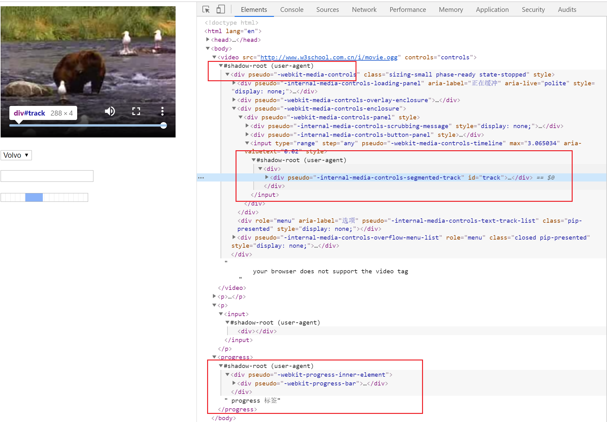
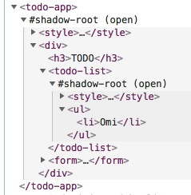
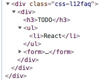

## 认识 Shadow DOM

### 什么是 Shadow DOM

Shadow DOM 是 Web Components 定义的四大标准之一(Custom elements, Shadow DOM, HTML templates 和 HTML Imports)。

Shadow DOM是一组**JavaScript API**，用于将封装的“影子”DOM树附加到元素（与主文档DOM分开呈现）并控制其关联的功能。通过这种方式，您可以保持元素的功能私有，这样它们就可以被脚本化和样式化，而不用担心与文档的其他部分发生冲突。这直接解决了HTML、CSS 和 JS 的**全局性**污染的问题。

### Shadow DOM 结构表现

第一步：打开 Chrome 的开发者工具，点击右上角的“Settings”按钮，勾选“Show user agent shadow DOM”。
第二步：创建包含 `video` 元素的页面（`audio`, `select`, `progress`, `input` 等等 都行)



`#shadow-root`称为影子根，可以看到它在video里面，换句话说，`#shadow-root`寄生在`video`上，所以video此时称为影子宿主。可以看到上图有两个`#shadow-root`，这是因为`#shadow-root`可以嵌套，形成节点树，即称为影子树（shadow trees）。影子树对其中的内容进行了封装，有选择性的进行渲染。这就意味着我们可以插入文本、重新安排内容、添加样式等等。


### Shadow DOM vs DOM vs Light DOM

> tip: Light DOM 组件用户编写的标记，该 DOM 不在组件 shadow DOM 之内，它是元素实际的子项。
> 如：`<button is="better-button"><span>Settings</span></button>`

shadow DOM 有以下优点：

1. 隔离 DOM：组件的 DOM 是独立的（例如，`document.querySelector()` 不会返回组件 Shadow DOM 中的节点）。

2. 作用域 CSS：Shadow DOM 内部定义的 CSS 在其作用域内。样式规则不会泄漏，页面样式也不会渗入。

3. 组合：为组件设计一个声明性、基于标记的 API。

4. 简化 CSS： 作用域 DOM 意味着您可以使用简单的 CSS 选择器，更通用的 id/class 名称，而无需担心命名冲突。

5. 效率：将应用看成是多个 DOM 块，而不是一个大的（全局性）页面。

### 使用 Shadow DOM

```html
...
<style type="text/css">
#app {
    --text-color: green;
}
</style>
<div id="app">
    <h1>我是根元素</h1>
</div>
<script>
    const app = document.getElementById('app');
    const shadowRoot = app.attachShadow({mode: 'open'});
    shadowRoot.innerHTML = `
    <style>
        :host {color: blue;}
        h2 {color: var(--text-color, black);background: red;}
    </style>
    <h2>Hello Shadow DOM</h2>
    `;
    const span = document.createElement('span');
    span.textContent = "你好";
    shadowRoot.appendChild(span);

    let css = document.createTextNode("h2{ font-size: 20px}");
    const style = document.createElement('style')
    style.appendChild(css)
    shadowRoot.appendChild(style)

    setTimeout(_ => {
        span.textContent = "两秒后我改变了";
        span.setAttribute('style', 'color: green;');
        css = document.createTextNode("h2{ font-size: 30px}");
        style.appendChild(css)
    }, 2000)
</script>
```

在原生dom节点上创建shadowDOM,添加样式和内容，并进行更新。


注意点：

1. 并不是所有的元素都可以挂载 Shadow DOM，其主要原因是：

   1. 浏览器已为该元素托管其自身的内部 shadow DOM（比如 textarea、input）。
   2. 让元素托管 shadow DOM 毫无意义 (比如 img)。
2. Shadow DOM，一旦创建就无法删除，它只能用新的替换
3. 在调用 attachShadow 创建 ShadowRoot 之后，attachShdow 方法会返回 ShadowRoot 对象实例
4. `mode` 有 `open` 和 `closed` 选项，当为 closed 时无法获取shadowRoot属性
5. 增加 Shadow DOM 后原父级子元素会无效
6. 更新内容和样式都使用原生的JavaScript API


### 基于 Shadow DOM 的前端框架 [omi](https://github.com/Tencent/omi/blob/master/README.CN.md) ——  腾讯出品

比同样开发 TodoApp， Omi 和 React 渲染完的 DOM 结构，Omi 使用 Shadow DOM 隔离样式和语义化结构:

 


### 参考

1. [Shadow DOM v1：独立的网络组件](https://developers.google.com/web/fundamentals/web-components/shadowdom?hl=zh-cn)
2. [神奇的Shadow DOM](https://aotu.io/notes/2016/06/24/Shadow-DOM/index.html)